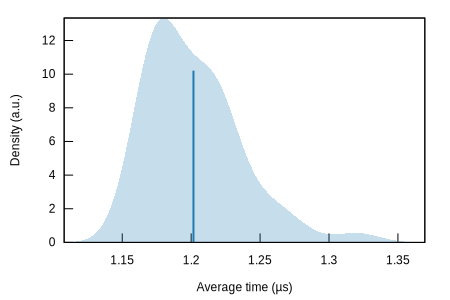
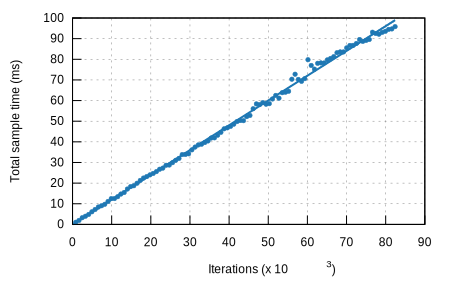

# tzf-rs: a fast timezone finder for Rust. [](https://github.com/ringsaturn/tzf-rs/actions/workflows/rust.yml) [](https://docs.rs/tzf-rs) [](https://codecov.io/gh/ringsaturn/tzf-rs)


## Build options

By default, the binary is built as well. If you don't want/need it, then build
like this:

```bash
cargo build --no-default-features
```

Or add in the below way:

```bash
cargo add tzf-rs --no-default-features
```

## Best practice

It's expensive to init tzf-rs's Finder/FuzzyFinder/DefaultFinder, please
consider reuse it or as a global var. Below is a global var example:

```rust
use lazy_static::lazy_static;
use tzf_rs::DefaultFinder;

lazy_static! {
    static ref FINDER: DefaultFinder = DefaultFinder::new();
}

fn main() {
    print!("{:?}\n", FINDER.get_tz_name(116.3883, 39.9289));
    print!("{:?}\n", FINDER.get_tz_names(116.3883, 39.9289));
}
```

For reuse it,
[`racemap/rust-tz-service`](https://github.com/racemap/rust-tz-service) is a
good example.

A Redis protocol demo could be used here:
[redizone](https://github.com/ringsaturn/redizone).

## Performance

The tzf-rs package is intended for high-performance geo spatial query services,
such as weather forecasting APIs. Most queries can be returned within a very
short time, averaging around 3000 nanoseconds(there is 1000ns slower compared
with Go repo `tzf` and I will continue to improve that, you can track progress
[here](https://github.com/ringsaturn/geometry-rs/issues/3)).

Here is what has been done to improve performance:

1. Using pre-indexing to handle most queries takes approximately 1000
   nanoseconds.
2. Using a finely-tuned Ray Casting algorithm package
   <https://github.com/ringsaturn/geometry-rs> to verify whether a polygon
   contains a point.

That's all. There are no black magic tricks inside the tzf-rs.

Below is a benchmark run on global cities(about 14K), and avg time is about 3000
ns per query:

```
test benches_default::bench_default_finder_random_city ... bench:       2,870 ns/iter (+/- 182)
```

| Criterion result | Pic                              |
| ---------------- | -------------------------------- |
| PDF              |         |
| Regression       |  |

You can view more details from latest benchmark from
[GitHub Actions logs](https://github.com/ringsaturn/tzf-rs/actions/workflows/rust.yml).

## References

I have written an article about the history of tzf, its Rust port, and its Rust
port's Python binding; you can view it
[here](https://blog.ringsaturn.me/en/posts/2023-01-31-history-of-tzf/).

- Original Go repo: <https://github.com/ringsaturn/tzf>
- Binary timezone data: <https://github.com/ringsaturn/tzf-rel>
- Geometry: use <https://github.com/ringsaturn/geometry-rs> which is
  <https://github.com/tidwall/geometry>'s Rust port.
- Continuous Benchmark compared with other packages:
  <https://github.com/ringsaturn/tz-benchmark>

### Bindings

- Ruby, see [tzf-rb](https://github.com/HarlemSquirrel/tzf-rb)
- Python, see [tzfpy](https://github.com/ringsaturn/tzfpy)

## LICENSE

This project is licensed under the [MIT license](./LICENSE). The data is
licensed under the
[ODbL license](https://github.com/ringsaturn/tzf-rel/blob/main/LICENSE), same as
[`evansiroky/timezone-boundary-builder`](https://github.com/evansiroky/timezone-boundary-builder)
