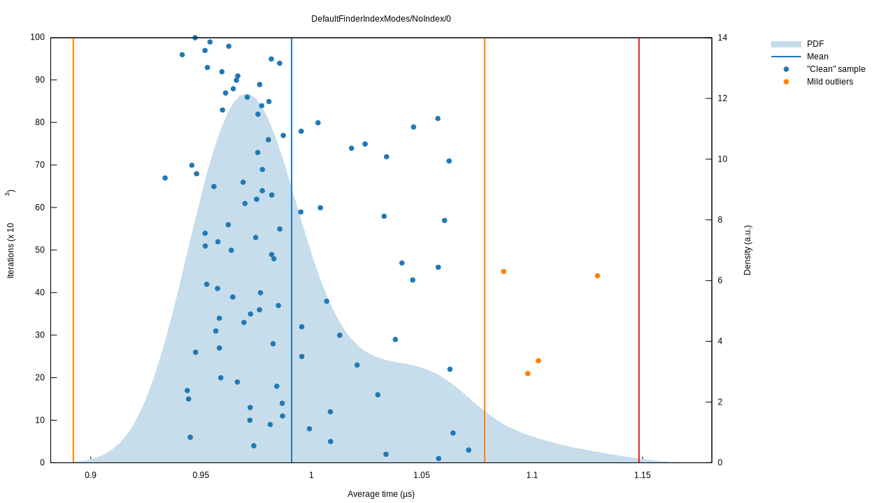
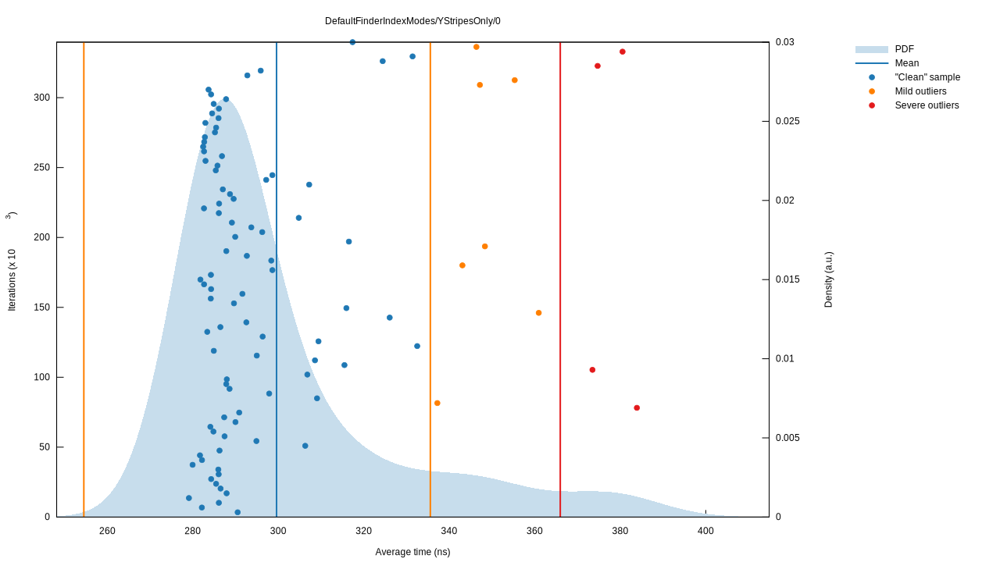

# tzf-rs: a fast timezone finder for Rust. [](https://github.com/ringsaturn/tzf-rs/actions/workflows/rust.yml) [](https://docs.rs/tzf-rs) [](https://crates.io/crates/tzf-rs)


[](https://app.fossa.com/projects/git%2Bgithub.com%2Fringsaturn%2Ftzf-rs?ref=badge_shield)

> [!NOTE]
>
> This package uses simplified shape data so it is not entirely accurate around
> the border.

- Released documentation: [docs.rs/tzf-rs](https://docs.rs/tzf-rs)
- Latest documentation(not released yet):
  [ringsaturn.github.io/tzf-rs](https://ringsaturn.github.io/tzf-rs/tzf_rs/)
- Try it online: [tzf-web](https://ringsaturn.github.io/tzf-web/)

## Build options

By default, the binary is built as well. If you don't want/need it, you can omit
the default features and build like this:

```bash
cargo build --no-default-features
```

Or add in the below way:

```bash
cargo add tzf-rs --no-default-features
```

## Best Practices

It's expensive to init tzf-rs's `Finder`/`FuzzyFinder`/`DefaultFinder`, so
please consider reusing instances or creating one as a global variable. Below is
a global variable example:

```rust
use lazy_static::lazy_static;
use tzf_rs::DefaultFinder;

lazy_static! {
    static ref FINDER: DefaultFinder = DefaultFinder::new();
}

fn needless_main() {
    // Please note coords are lng-lat.
    print!("{:?}\n", FINDER.get_tz_name(116.3883, 39.9289));
    print!("{:?}\n", FINDER.get_tz_names(116.3883, 39.9289));
}
```

For reuse,
[`racemap/rust-tz-service`](https://github.com/racemap/rust-tz-service) provides
a good example.

A Redis protocol demo could be used here:
[`ringsaturn/redizone`](https://github.com/ringsaturn/redizone).

### Setup 100% Accurate Lookup

By default, tzf-rs uses a simplified shape data. If you need 100% accurate
lookup, you can use the following code to setup.

1. Download
   [full data set](https://github.com/ringsaturn/tzf-rel/blob/main/combined-with-oceans.bin),
   about 90MB.
2. Use the following code to setup.

```rust,ignore
use tzf_rs::Finder;
use tzf_rs::pbgen::tzf::v1::Timezones;

pub fn load_full() -> Vec<u8> {
    include_bytes!("./combined-with-oceans.bin").to_vec()
}

fn main() {
    println!("Hello, world!");
    let file_bytes: Vec<u8> = load_full();

    let finder = Finder::from_pb(Timezones::try_from(file_bytes).unwrap_or_default());
    let tz_name = finder.get_tz_name(139.767125, 35.681236);
    println!("tz_name: {}", tz_name);
}
```

A full example can be found
[here](https://github.com/ringsaturn/tzf-rs/pull/170).

## Advanced Usage - Speed up via YStripes Index

`tzf-rs` builds polygon index structures through `geometry-rs`.
`Finder::from_pb` uses `FinderOptions::default()`, which is
`FinderOptions::NoIndex`.

If you need to tune build time and query latency for your own workload, use an
explicit index mode.

```rust,ignore
use tzf_rs::{DefaultFinder, Finder, FinderOptions};

fn main() {
    let options = FinderOptions::y_stripes();
    let default_finder = DefaultFinder::new_with_options(options);
    println!("{}", default_finder.get_tz_name(139.767125, 35.681236));
}
```

Tuning notes:

1. Use `FinderOptions::y_stripes()` to enable the YStripes polygon index.
2. `FinderOptions::NoIndex` explicitly disables polygon indexes. By default, no
   index is used, which has the fastest build time and the slowest query time.
   But may be changed in the future, so it's better to explicitly specify it if
   you want no index.
3. YStripes needs more time and memory than NoIndex, below is data from my
   machine to build the `DefaultFinder` with currently supported index modes:

   | Index mode    | Build time (ms) | Memory usage (MiB) |
   | ------------- | --------------: | -----------------: |
   | No index      |             ~40 |                ~70 |
   | YStripes only |             ~50 |               ~110 |

For the performance comparison of different index modes, please see the
[Performance](#performance) section below.

## Advanced Usage - Export GeoJSON

> [!NOTE]
>
> This feature is designed for **data visualization purposes** and I can't
> guarantee the performance when using it in high-performance scenarios. Please
> do proper performance tests and necessary optimizations before using it in
> high performace production, for example caching the exported GeoJSON data or
> push to CDN.

It's a common use case make some visualization of timezone boundaries. For this
purpose, tzf-rs provides methods to export the preindex tile data or specific
timezone polygons as GeoJSON format.

To enable this feature, you need to build tzf-rs with `export-geojson` feature:

```toml
# Please note that >= 1.1.1 is required to have full GeoJSON functionality.
tzf-rs = { version = "{version}", features = ["export-geojson"]}
```

Then you can use the following methods:

```rust,ignore
// examples/query_tokyo.rs
use tzf_rs::DefaultFinder;

fn main() {
    let default_finder = DefaultFinder::new();
    let lng = 139.6917;
    let lat = 35.6895;

    let tz_name = default_finder.get_tz_name(lng, lat).to_owned();
    println!(
        "The timezone at longitude {}, latitude {} is: {}",
        lng, lat, tz_name
    );

    // Get the Polygon boundary for the timezone
    if let Some(boundary_file) = default_finder.finder.get_tz_geojson(&tz_name) {
        // It's GeoJSON Feature Collection, and the features contains "MultiPolygon" geometry for the timezone.
        println!("Found GeoJSON feature for timezone: {}", tz_name);
        let mut polygons: usize = 0;
        for feature in boundary_file.features {
            polygons += feature.geometry.coordinates.len();
        }
        println!(
            "Total number of polygons in feature collection: {}",
            polygons
        );
    }

    // Get the Index polygon boundary for the timezone
    if let Some(index_boundary_file) = default_finder.fuzzy_finder.get_tz_geojson(&tz_name) {
        // It's GeoJSON Feature, and the geometry contains "MultiPolygon" for the timezone index.
        // But the Polygons are actually map tiles.
        println!("Found Index GeoJSON feature for timezone: {}", tz_name);
        let mut polygons: usize = 0;
        for polygon in index_boundary_file.geometry.coordinates {
            polygons += polygon.len();
        }
        println!(
            "Total number of tile polygons in index feature: {}",
            polygons
        );
    }
}
```

```bash
cargo run --example query_tokyo --features export-geojson
```

```console
The timezone at longitude 139.6917, latitude 35.6895 is: Asia/Tokyo
Found GeoJSON feature for timezone: Asia/Tokyo
Total number of polygons in feature collection: 24
Found Index GeoJSON feature for timezone: Asia/Tokyo
```

For now, tzf-rs' binding in Wasm, named
[tzf-wasm](https://github.com/ringsaturn/tzf-wasm)), has exported this feature
and it has been deployed to the [tzf-web](https://ringsaturn.github.io/tzf-web/)
for online usage.

## Performance

The tzf-rs package is intended for high-performance geospatial query services,
such as weather forecasting APIs. Most queries can be returned within a very
short time, averaging around 1,500 nanoseconds.

Here is what has been done to improve performance:

1. Using pre-indexing to handle most queries takes approximately 500
   nanoseconds.
2. Using a finely-tuned Ray Casting algorithm package
   [`ringsaturn/geometry-rs`](https://github.com/ringsaturn/geometry-rs) to
   verify whether a polygon contains a point.
3. Using YStripes to accerate polygon queries. This polygon index works when the
   pre-indexing missing, especially for queries around the border.

That's all. There are no black magic tricks inside the tzf-rs.

Below is a benchmark run on my MacBook Pro with Apple M3 Max:

```bash
make bench
cat benchmark_report.md
```

| Target        | Scenario      | Median estimate (µs) | Approx throughput (ops/s) | Avg peak RSS (MiB) |
| ------------- | ------------- | -------------------: | ------------------------: | -----------------: |
| Finder        | YStripes only |               2.4286 |                   411,760 |              89.75 |
| Finder        | No index      |               6.0933 |                   164,115 |              53.03 |
| DefaultFinder | YStripes only |               0.9726 |                 1,028,172 |             111.58 |
| DefaultFinder | No index      |               1.8955 |                   527,565 |              74.01 |

NOTE: The `FuzzyFinder` is not included in the benchmark, since it's query time
is consistent.

<details>
<summary>DefaultFinder's Benchmark charts (click to expand)</summary>

Violin plot:

<!-- TODO: replace https link

https://raw.githubusercontent.com/ringsaturn/tzf-rs/refs/heads/main/

-->


No Index:



YStripes only:



</details>

You can view more details from latest benchmark from
[GitHub Actions logs](https://github.com/ringsaturn/tzf-rs/actions/workflows/rust.yml).

## References

I have written an article about the history of `tzf`, its Rust port, and its
Rust port's Python binding; you can view it
[here](https://blog.ringsaturn.me/en/posts/2023-01-31-history-of-tzf/).

- Original Go repo: [`ringsaturn/tzf`](https://github.com/ringsaturn/tzf)
- Binary timezone data:
  [`ringsaturn/tzf-rel`](https://github.com/ringsaturn/tzf-rel)
- Geometry: use
  [`ringsaturn/geometry-rs`](https://github.com/ringsaturn/geometry-rs) which is
  [`tidwall/geometry`](https://github.com/tidwall/geometry)'s Rust port.
- Continuous Benchmark compared with other packages:
  [`ringsaturn/tz-benchmark`](https://github.com/ringsaturn/tz-benchmark)

### Bindings

- Ruby, see [`HarlemSquirrel/tzf-rb`](https://github.com/HarlemSquirrel/tzf-rb)
- Python, see [`ringsaturn/tzfpy`](https://github.com/ringsaturn/tzfpy)
- Wasm, see [`ringsaturn/tzf-wasm`](https://github.com/ringsaturn/tzf-wasm)
- PostgreSQL extension, see
  [`ringsaturn/pg-tzf`](https://github.com/ringsaturn/pg-tzf)

## Command line

The binary helps in debugging tzf-rs and using it in (scripting) languages
without bindings. Either specify the coordinates as parameters to get a single
time zone, or to look up multiple coordinates efficiently specify the ordering
and pipe them to the binary one pair of coordinates per line.

```shell
tzf --lng 116.3883 --lat 39.9289
echo -e "116.3883 39.9289\n116.3883, 39.9289" | tzf --stdin-order lng-lat
```

If you are using Nixpkgs, you can install the `tzf` command line tool, please
see more in
[Nixpkgs](https://search.nixos.org/packages?channel=unstable&type=packages&query=tzf-rs).

## LICENSE

This project is licensed under the [MIT license](./LICENSE) and
[Anti CSDN License](./LICENSE_ANTI_CSDN.md)[^anti_csdn]. The data is licensed
under the
[ODbL license](https://github.com/ringsaturn/tzf-rel/blob/main/LICENSE), same as
[`evansiroky/timezone-boundary-builder`](https://github.com/evansiroky/timezone-boundary-builder)

[^anti_csdn]: This license is to prevent the use of this project by CSDN, has no
    effect on other use cases.

[](https://app.fossa.com/projects/git%2Bgithub.com%2Fringsaturn%2Ftzf-rs?ref=badge_large)
